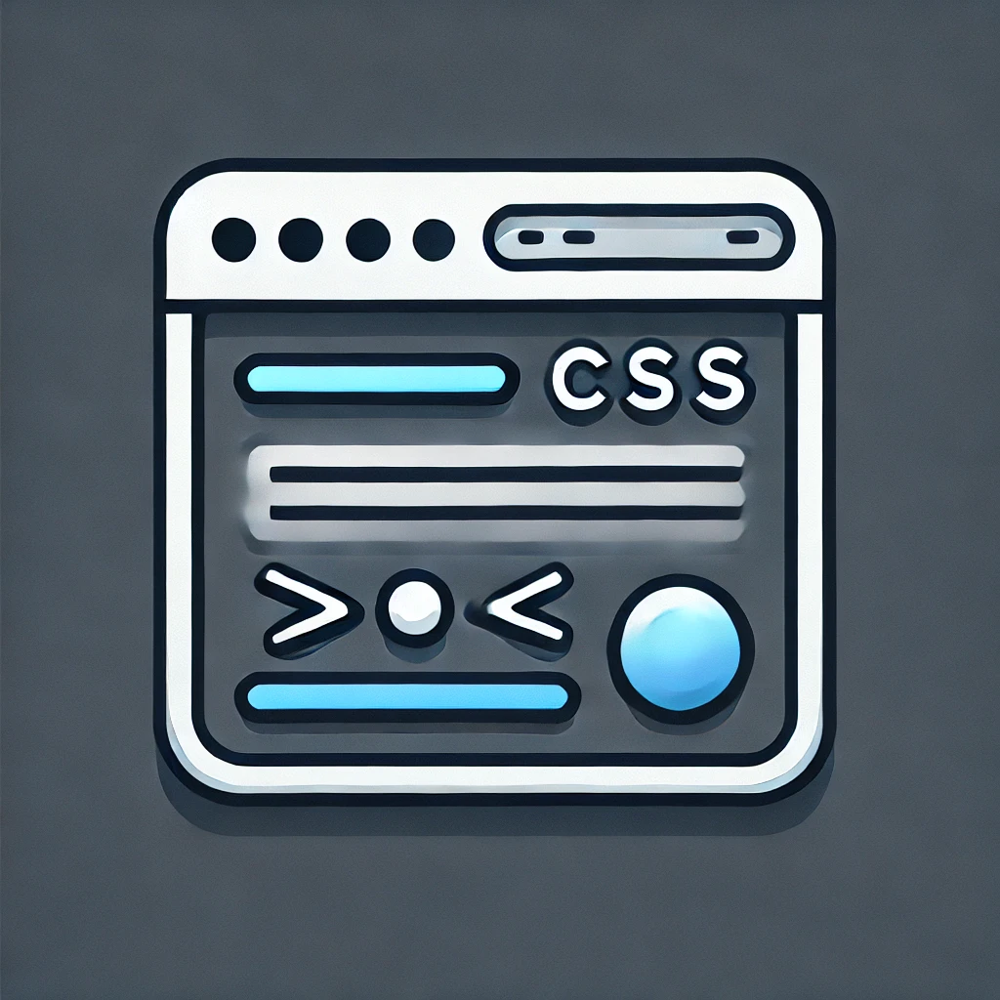
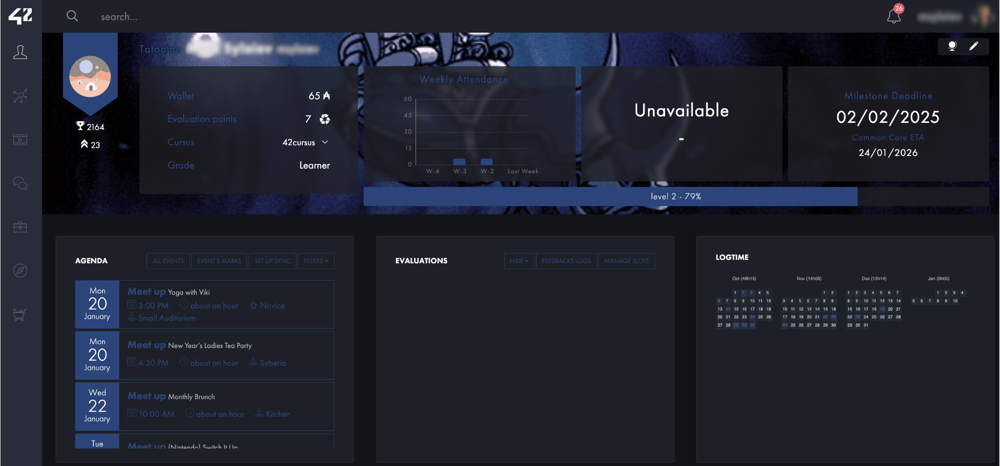
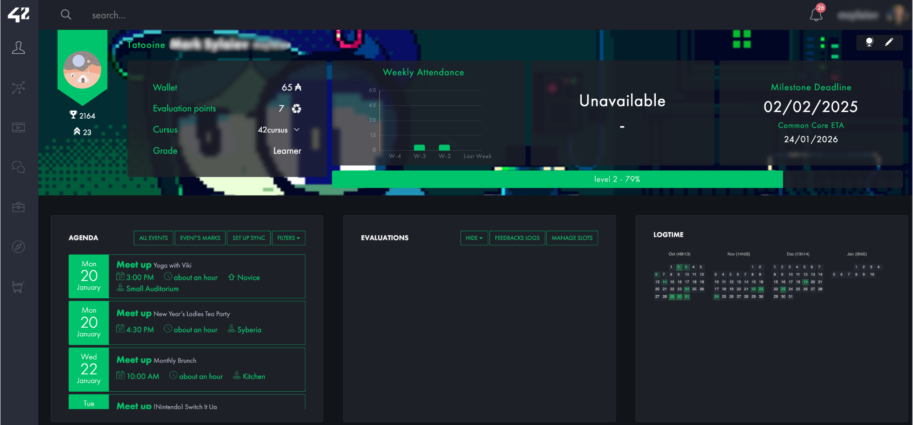
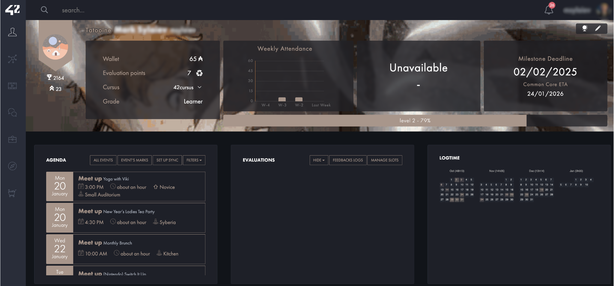
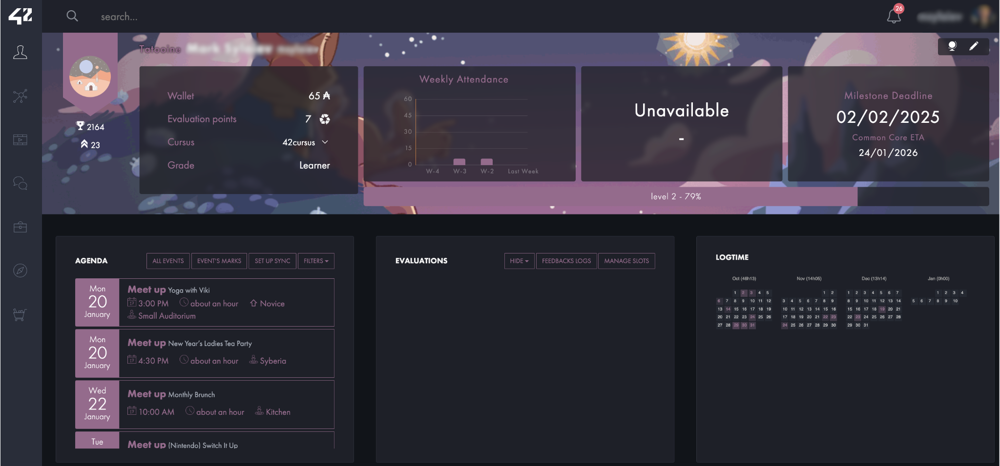
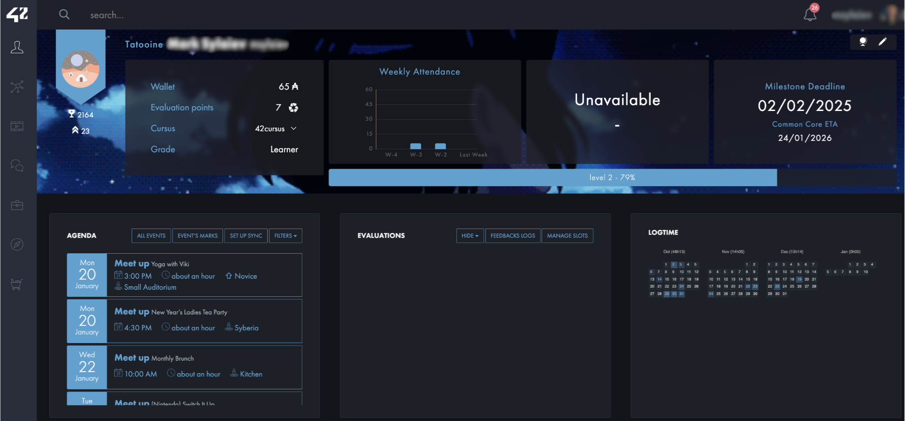

<div align="center">
  
</div>
<br>
<div align="center">
  
  
  
  
  <br>
</div>

---

# 🎨 Intra 42 School Themes

This project provides custom **CSS themes** for the **Stylus browser extension**, designed specifically to enhance and personalize the **Intra website** of **42 School**. With a focus on usability and aesthetics, this **open-source** project makes it easy to transform the look and feel of your **Intra** experience.

*	**CSS** themes built for the **42 School** **Intra** website.
*	Includes **5 unique themes** tailored for different styles and preferences.
*	Fully compatible with **Stylus** extension on **Chrome** and **Firefox**.
*	Lightweight, easy to customize, and perfect for personalizing your **Intra**.

Elevate your browsing experience with these beautifully crafted themes!

---

## 🚀 Installation

Follow these simple steps to enhance your Intra 42 experience with custom themes:

1. **Install the Improved Intra 42 Browser Extension**:
    - [Google Chrome](https://chromewebstore.google.com/detail/improved-intra-42/hmflgigeigiejaogcgamkecmlibcpdgo)
    - [Firefox](https://github.com/FreekBes/improved_intra/releases/latest/download/firefox.xpi)

2. **Install the Stylus Browser Extension**:
   - [Chrome](https://chrome.google.com/webstore/detail/stylus/clngdbkpkpeebahjckkjfobafhncgmne?hl=en)
   - [Firefox](https://addons.mozilla.org/en-US/firefox/addon/styl-us)

3. **Choose and Install a Theme**:
   - Click on one of the theme install links provided below.

4. **Apply the Style**:
   - The Stylus extension will open with an **Install Style** button. Click it to apply the theme!

---

## ⚔️ Hollow Knight

[**Install Theme**](https://github.com/marsdevx/intra42-themes/raw/refs/heads/main/hollow_knight.user.css)



---

## 🧪 Inventor

[**Install Theme**](https://github.com/marsdevx/intra42-themes/raw/refs/heads/main/inventor.user.css)



---

## 🧙‍♂️ Mushoku Tensei

[**Install Theme**](https://github.com/marsdevx/intra42-themes/raw/refs/heads/main/mushoku_tensei.user.css)



---

## ✨ Star

[**Install Theme**](https://github.com/marsdevx/intra42-themes/raw/refs/heads/main/star.user.css)



---

## 🌸 Your Name

[**Install Theme**](https://github.com/marsdevx/intra42-themes/raw/refs/heads/main/your_name.user.css)



---

## 📋 License

All the code contained in this repo is licensed under the [MIT License](LICENSE)

```
MIT License

Copyright (c) 2025 marsdevx

Permission is hereby granted, free of charge, to any person obtaining a copy
of this software and associated documentation files (the "Software"), to deal
in the Software without restriction, including without limitation the rights
to use, copy, modify, merge, publish, distribute, sublicense, and/or sell
copies of the Software, and to permit persons to whom the Software is
furnished to do so, subject to the following conditions:

The above copyright notice and this permission notice shall be included in all
copies or substantial portions of the Software.

THE SOFTWARE IS PROVIDED "AS IS", WITHOUT WARRANTY OF ANY KIND, EXPRESS OR
IMPLIED, INCLUDING BUT NOT LIMITED TO THE WARRANTIES OF MERCHANTABILITY,
FITNESS FOR A PARTICULAR PURPOSE AND NONINFRINGEMENT. IN NO EVENT SHALL THE
AUTHORS OR COPYRIGHT HOLDERS BE LIABLE FOR ANY CLAIM, DAMAGES OR OTHER
LIABILITY, WHETHER IN AN ACTION OF CONTRACT, TORT OR OTHERWISE, ARISING FROM,
OUT OF OR IN CONNECTION WITH THE SOFTWARE OR THE USE OR OTHER DEALINGS IN THE
SOFTWARE.
```